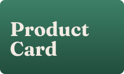
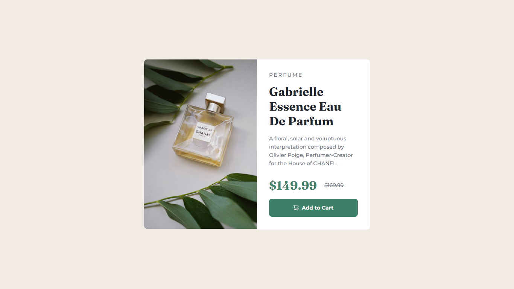

# Product Card

Um projeto de aprendizado em Angular 17. Experimentando e explorando a criação de componentes utilizando as funcionalidades que a nova versão do Angular fornece. O layout e design deste projeto foi inspiração da plataforma [Frontend Mentor](https://www.frontendmentor.io/home), que disponibiliza diversos desafios para praticar as habilidades front-end.

[Clique aqui](https://lf-product-card-angular.vercel.app/) acessar e conferir este projeto, ou acesse: https://lf-product-card-angular.vercel.app/

## Tecnologias

## Aprendizado

Como aprendizado coloquei em prática a criação de componentes em Angular, nada complexo apenas o básico pois estaria iniciando agora em Angular visto que venho do ambiente React e Next. Tentei aplicar e trazer os ensinamentos do React para este projeto Angular, como por exemplo utilizar as props de componentes.

## Demonstração

